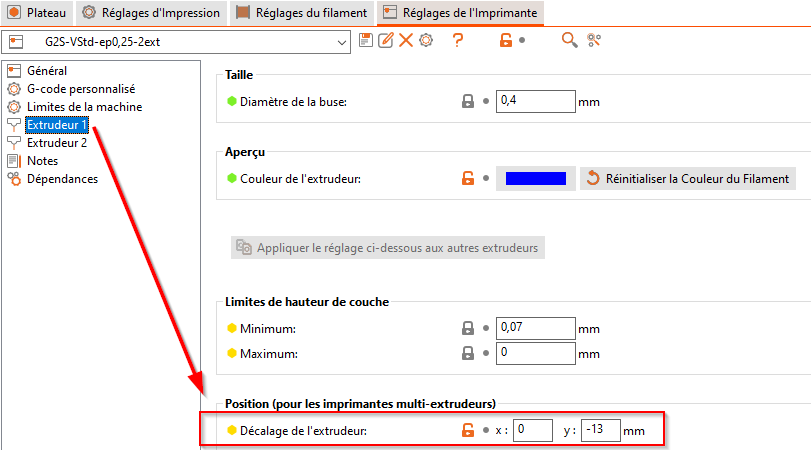
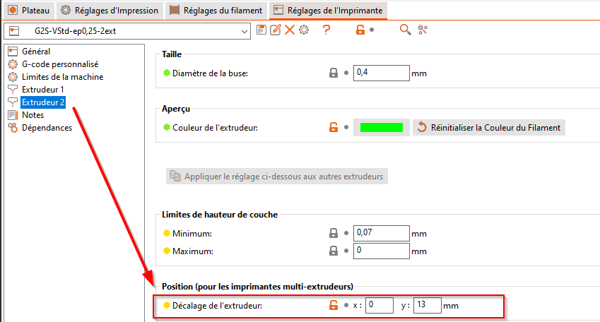

# Configuration de l'imprimante

lien notice de démarrage :

quelques liens :

repetier :

firmware :

## Modifications du firmware :

### Fichier configuration.h

Lien : [configuration.h](Geeetech_Delta_G2S_Pro\Marlin_Geeetech_RKMB_GT2560_G2S_Pro\Marlin\Configuration.h)

#### 🔵 Ligne : #define EXTRUDERS

Définis le nombre d'extrudeurs que l'on veux/peux utiliser. Pour la G2S Pro, la valeur doit être égale à 2. Cependant poru démarrer, il est possible de ne configurer qu'un seul extrudeur. Dans ce cas, le centre d'impression sera décalé du centre du plateau de 13 mm environ vers l'avant. A prendre en compte lors des premiers essais pa rrapport à la circonférence du plateau.

Exemple:

```
// This defines the number of extruders
#define EXTRUDERS 1	// l'imprimante ne reconnait qu'un seul extrudeur
```

```
// This defines the number of extruders
#define EXTRUDERS 2	// l'imprimante reconnait les 2 extrudeurs.
```

⚠**Attention**⚠: dans le cas d'une configuration à 2 extrudeurs, il faut veiller à paramétrer correctement la chauffe du second extrudeur spécifiquement.

⚠**Attention**⚠: Il faut aussi veiller à ce que les 2 extrudeurs soient très exactement à la même hauteur sous peine de voir vos impressions dégradées par celui des 2 extrudeurs qui est trop bas.

#### 🔵 Ligne : #define DELTA_DIAGONAL_ROD

La valeur de DELTA_DIAGONAL_ROD doit correspondre à la longueur des bras de l'imprimante, la mesure est à prendre au centre des poulies de part et d'autre de l'axe.

Exemple :

```
// Center-to-center distance of the holes in the diagonal push rods.
#define DELTA_DIAGONAL_ROD 199		// Valeur en millimètres. Si cette valeur est fausse, les dimensions longueur et largeur seront fausses.
```

⚠**Attention**⚠: Chaque bras doit faire exactement la même dimension afin que l'impression soit correctement proportionnée sur chaque axe X, Y, et Z.

⚠**Attention**⚠: Dimensions d'objet à réduire => augmenter la valeur, dimension d'objet à augmenter => réduire la valeur.

#### 🔵 Ligne : #define DELTA_RADIUS

Il s'agit d'un paramètre calculé à partir des dimensions de la tête d'impression et des bras, et qui permet à l'imprimante de savoir ou elle s trouve dans l'espace. Ce qu'il faut retenir, c'est que cette valeur détermine le suivis du plateua d'impression au plus près.

Ainsi, si le plateau est parfaitement plat, cetet valeur ne doit pas être modifiée. En revanche :

- si le plateau est convexe, ou que l'imprimante considère qu'il est convexe, il convient de décrémenter la valeur en dessous de 1
- Si le plateau est concave ou que l'imprimante considère qu'il est concave, il convient d'incrémenter la valeur au dessus de 1

⚠**Attention**⚠: Comment je sais que mon plateau est concave ou convexe ? C'est lorsque, une fois que les endstops sont parfaitements ajustés et que la tête d'impression est au même niveau sur les 3 points sous les endstops, et que celle-ci reviens au centre du plateau, elle n'est plus au même niveau que ces 3 points périphériques. Soit la tête est trop haute au point Z=0, auquel cas le plateau est à considérer comme concave (cuvette), soit elle est trop basse et touche le plateau avant d'atteindre Z=0, dans ce cas le plateau est considéré comme convexe (dôme).

Exemple :

```
// Horizontal distance bridged by diagonal push rods when effector is centered.
//#define DELTA_RADIUS (DELTA_SMOOTH_ROD_OFFSET-DELTA_EFFECTOR_OFFSET-DELTA_CARRIAGE_OFFSET+1)  // Valeur originale
#define DELTA_RADIUS (DELTA_SMOOTH_ROD_OFFSET-DELTA_EFFECTOR_OFFSET-DELTA_CARRIAGE_OFFSET+1.3)
```

Dans ce cas de figure, la plateau après premier réglage des endstops était concave. Il a fallu ajuster la valeur par incrément de 0,1, puis régler de nouveau dans l'ordre le Z=0 au centre, puis le Z=0 sous les endstops, et revenir au Z=0 au centre. il s'agit d'un réglage itératif nécessaire pour obtenir un aplat correct des impressions sur le plateau circulaire d'une imprimante delta.

#### 🔵 Ligne : #define DELTA_PRINTABLE_RADIUS

Il s'agit de définir la zone imprimable sur le plateau de la G2S. Le plateau fait 22cm de diamètre, ce qui donne un rayon de 11 cm. Cependant, il faut tenir compte de la taille du chariot de la tête d'impression et des dimensions des bras d'impression. Ici un diamètre de 20 cm est tout à fait jouable, ce qui donne une valeur d erayon de 10 cm. La baleur est à inscrire en mm, soit 100 mm.

Exemple :

```
// Print surface diameter/2 minus unreachable space (avoid collisions with vertical towers).
#define DELTA_PRINTABLE_RADIUS 100	// Valeur en millimètres
```

⚠**Attention**⚠: Si l'impression dépasse la limite de rayon donné, l'impirmante tronquera simplement l'objet aux limites données par le rayon.

⚠**Attention**⚠: A l'inverse, si le rayon définis est trop grand, le chariot d'impression ira buter sur les axes de l'imprimante.

#### 🔵 Ligne : #define TEMP_SENSOR_0 et la suivante #define TEMP_SENSOR_1

Ces paramètres définissent le type de thermistance utilisée pour suivre la température de chaque buse. Le code du firmware est documenté et le svaleurs pré-paramétrées à 1 pour pour des thermistances de 100k.

Pour démarrer la configuration de l'imprimante ou n'utiliser que l'une ou l'autre des buses, il est possible de mettre ce paramètre à 0. Dans mon cas, ne voulant imprimer au départ qu'avec une buse, j'ai décidé de mettre TEMP_SENSOR_1 à 0, soit "not used" afin de limiter les risques de chauffe imprévus sur cette buse.

Exemple :

```
// :{ '0': "Not used", '4': "10k !! do not use for a hotend. Bad resolution at high temp. !!", '1': "100k / 4.7k - EPCOS", ... ... - Aller voir le code du firmware pour une liste complète de valeurs - }
#define TEMP_SENSOR_0 1
#define TEMP_SENSOR_1 1 	// Mettre à 0 pour buse 1 inutilisée. Ajuster aussi #define EXTRUDERS traité plus haut.
```

#### 🔵 Ligne : const bool Z_MIN_ENDSTOP_INVERTING

La valeur de Z_MIN_ENDSTOP_INVERTING doit impértaivement être à true, comme indiqué dans la documentataion de paramétrage, sans quoi, l'axe Z se comporte à l'inverse de ce qui est attendu.

Exemple :

```
// Mechanical endstop with COM to ground and NC to Signal uses "false" here (most common setup).
const bool X_MIN_ENDSTOP_INVERTING = false; // set to true to invert the logic of the endstop.
const bool Y_MIN_ENDSTOP_INVERTING = false; // set to true to invert the logic of the endstop.
const bool Z_MIN_ENDSTOP_INVERTING = true; // set to true to invert the logic of the endstop.	// Modifié à true
const bool X_MAX_ENDSTOP_INVERTING = false; // set to true to invert the logic of the endstop.
const bool Y_MAX_ENDSTOP_INVERTING = false; // set to true to invert the logic of the endstop.
const bool Z_MAX_ENDSTOP_INVERTING = false; // set to true to invert the logic of the endstop.
const bool Z_PROBE_ENDSTOP_INVERTING = false; // set to true to invert the logic of the endstop.
```

⚠**Attention**⚠: Lors de la première mise en route procéder manuellement avec Repetier aux tests de mouvement de la tête d'impression. Si celle-ci bouge dans un sens imprévu, il faut probablemen ajuster un de sparmaètres de ce bloc de code.

#### 🔵 Ligne : #define DELTA_PROBABLE_RADIUS

Il s'agit de définir le périmètre utile pour la sonde permettant l'auto-levelling. Celle-ci est excentrée par rapport aux buses, ce qui induit une réduction du périmètre de test. Il faut mesurer la distance latérale entre les buses et la sonde, puis reporter cette valeur dans la formule de calcul de la variable (en millimètre toujours, et en sosustraction du périmètre d'impression puisqu'on le réduit pour la sonde). Sur la G2S, la sonde se trouve à 2 cm à gauche des buses.

Exemple :

```
#ifdef AUTO_BED_LEVELING_GRID

    #define DELTA_PROBABLE_RADIUS (DELTA_PRINTABLE_RADIUS - 20)		// Il faut retirer la valeur du périmètre d'impression
```

#### 🔵 Ligne : #define MIN_PROBE_EDGE

Ce paramètre donne la définition minimale des tests de contact de la sonde avec le plateau d'impression. En d'autre terme, le sdifférents tests se produiront à des intervalles/distances forcément supérieurs à MIN_PROBE_EDGE.

Exemple :

```
    #define MIN_PROBE_EDGE 10 	// La grille de tests ne pourra pas être plus petite que 10 millimètres entre chaque point
```

#### 🔵 Ligne : #define AUTO_BED_LEVELING_GRID_POINTS

Il s'agit du nombre de points de contact qui doivent être répartis sur la zone définie par DELTA_PROBABLE_RADIUS tout en respectant MIN_PROBE_EDGE.

Exemple :

```
  #define AUTO_BED_LEVELING_GRID_POINTS 8  	// indique 8 points de contacts à répartir sur le plateau
```

ℹ Pour info ℹ : L'algorithme qui détermine le nombre de contacts est paramétrable avec les 3 paramètres précédents. Le mieux est de faire quelques tests jusqu'à satisfaction sur la résolution des points de contacts versus le temps que cela met à chaque fois. Le mieux est encore de régler le plateau à la perfection une bonne fois. L'usage de la sonde s'avère alors complètement inutile au quotidien.

#### 🔵 Lignes : <Z/Y/Z>PROBE_OFFSET_FROM_EXTRUDER

Ces paramètres permettent de définir le point de contact exact entre la sonde et l'extrudeur.

X et Y déterminent les coordonnées relatives de la sonde par rapport à la buse 0.

Z détermine la hauteur à laquelel la sonde touche le plateau et active le contact (en endstop). La valeur de Z détermine ensuite la hauteur idéale de la buse par rapport au plateau pour génrer la première couche d'impression. Cette valeur est ensuite ajoutée ou retirée du zéro absolu lors de la conception du gcode d'impression pour les pièces.

Exemple :

```
  #define X_PROBE_OFFSET_FROM_EXTRUDER -19  // Probe on: -left  +right   
  #define Y_PROBE_OFFSET_FROM_EXTRUDER -11  // Probe on: -front +behind
  #define Z_PROBE_OFFSET_FROM_EXTRUDER -3.42  // -below (always!) 
```

Dans cet exemple, en considérant que le centre de la tête d'impression est la référence (ce qui est faux dans le cas d'une double-tête d'impression) la sonde se trouve à 19 millimètres à gauche, et à 11 millimètres en avant du centre de la tête d'impression (soit quasi au niveau de la buse 0).

La sonde entre en contact avec le endstop (ond oit entendre un "clic" au moment de la prise de mesure) lorsque la buse est à 3,42 millimètres du plateau. soit -3,42 millimètres à reporter sur Z_PROBE_OFFSET_FROM_EXTRUDER.

Etant donné que la sonde est mesurée via un endstop, le mieux est d'ensuite tester la vleur et de la modifier en focniton du resultat obtenu sur un test d'impression poru la première couche :

- Si la tête d'impression est trop basse et écrase trop la 1ere couche sur le plateau, il faut la remmonter. Dans ce cas, il faut ajouter de la valeur à Z_PROBE_OFFSET_FROM_EXTRUDER (par exemple passer la valeur de -3.42 à -3.30).
- Si la tête d'impression est trop haute et ne permet pas à la première couche d'impression d'adhérer correctement au plateau, il faut retirer de la valeur à Z_PROBE_OFFSET_FROM_EXTRUDER (par exemple passer la valeur de -3.42 à -3.50).

⚠**Attention**⚠: Procéder par petits ajustements (0,1 en 0,1) jusqu'à obtenir la bonne valeur et la bonne épaisseur de première couche, c'est cruciale afin d'éviter le "warping", c'est à dire le décollement de la pièce au cours de l'impression.

#### 🔵 Lignes : #define Z_RAISE_<BEFORE/BETWEEN/AFTER>_PROBING

Comme son nom l'indique, il s'agit de relever la tête d'impression, et donc la sonde d'une certaine valeur entre les phases de contacts. En effte, l'agorithme est fait de telle faàon, que le chemin entre les différents points de contacts est une courbe  cocnave, et en focniton de la distance, cela peut amener à ce que la sonde, voir la buse touche le plateau.

Il convient de régler ces valeurs à l'usage et en fonction du nombre de points de contact et du périmètre de test choisis.

Exemple :

```
#define Z_RAISE_BEFORE_PROBING 20    //How much the extruder will be raised before traveling to the first probing point.
#define Z_RAISE_BETWEEN_PROBINGS 10  //How much the extruder will be raised when traveling from between next probing points
#define Z_RAISE_AFTER_PROBING 20     //How much the extruder will be raised after the last probing point.
```

#### 🔵 Ligne : #define Z_PROBE_END_SCRIPT "M114\nG1 X0 Y0 F5000"

Cette ligne est en commentaire par défaut dans le code marlin RKMB 1.0.3 dev par défaut. Poru ma part je l'aid écommenté car elle permet de recentrer la tête d'impression après l'autolevelling.

Exemple :

```
 #define Z_PROBE_END_SCRIPT "M114\nG1 X0 Y0 F5000"
```

Ici, le script exécuté :

- M114 : Récupère la position courante de la tête d'impression
- \n : saut de ligne
- G1 X0 Y0 F5000 : position la tête d'impression à X=0, Y=0 à une vitesse de 5000 mm/minutes

Etant donné que plus haut, Z_RAISE_AFTER_PROBING a été définis à 20 mm, la tête sera positionnées à la fin en X=0, Y=0 et Z=20

⚠**Attention**⚠: La ligne de script peut être customisée au besoin. Juste se souvenir de bien sauter des lignes entre chaque command.

#### 🔵 Bloc : #ifdef MANUAL_HOME_POSITIONS

Il s'agit de définir les coordonnées centrales (home) du plateau. avec les paramètres MANUAL_<X/Y/Z>_HOME_POS.

⚠**Attention**⚠: A priori, aucune raison de vouloir redéfinir X et Y pour le home, sauf peut-être si on utilise qu'une seule des 2 buses, auquel cas on est tenté de redéfinir MANUAL_Y_HOME_POS à -13. Cependant, sur cette version de Marlin, il semble que cela décale l'assiette de l'impression. Je recommande donc de ne pas toucher aux paramètres X et Y et de faire avec le décalage de 13 mm si on utilise qu'une seule buse et qu'on désactive la 2eme.

MANUAL_Z_HOME_POS est quand à lui bien plus utile puisqu'il permet de définir la hauteur maximale de la tête d'impression par rapport au plateau après un Home (G28).

De cette valeur dépendra, et sauf si on utilise l'autolevelling, la qualité de la premièr ecouche d'impression. En effet, l'imprimante considèrera le niveau 0 (première couche) à MANUAL_Z_HOME_POS mm de la position à laquelle la buse se trouve en postion Home (G28).

Exemple :

```
#ifdef MANUAL_HOME_POSITIONS
  #define MANUAL_X_HOME_POS 0
  #define MANUAL_Y_HOME_POS 0  
  #define MANUAL_Z_HOME_POS 194.3  // For delta: Distance between nozzle and print surface after homing.
#endif
```

Ici les mesures de mon imprimante, après calibrage du plateau au niveau des axes (sous les endstops) et du centre du plateau, donnent une valeur de 194.3 mm pour une epaisseure de première couche de 0,2 environ, histoire d'écraser un peu le fil d'impression et gérer l'adhérence.

🔵 Ligne : #define DEFAULT_AXIS_STEPS_PER_UNIT

- Ce paramètre permet de gérer la hauteur d'impression avec les 3 premières valeurs. Si l'impression est trop écrasée ou trop haute par rapport à la taille prévue, il convient de recalibrer X, Y, et Z en même temps.

La méthode de recalibrage est de fair euen règle de 3 entr ela valeur d'origine, la dimension souhiatée et la diemnsion réellement obtenue.

⚠**Attention**⚠: les valeurs pour X,Y, et Z doivent être rigoureusement identique sous peine de décaler l'assiette d'impression. Modifier ces paramètres modifie aussi la mesure de MANUAL_Z_HOME_POS qui sera à recalibrer.

**Exercice** : pour un cube de 1cm de côté, j'obtiens, 1,2cm de hauteur. En conséquence avec une valeur de 80 initiale pour X,Y, et Z, pour obtenir 1cm, il me faut la rédéfinir à : nouvelle valeur = 80 * 10 / 12 = 66.6   ce qui correspond à une réduction du pas des moteurs pour un même mouvement demandé.

- La 4eme valeur du paramètre correspond au réglage du pas d'extrusion. Si l'imprimante génère des couches trop "riches" ou à l'inverse que le filament déposé est trop "pauvre", il faut calibrer ce paramètre poru ajuster le débitd e filament au plus juste.

**Exercice** : faire une marque à 150 millimetres sur le fil d'impression en sortie de bobine. Faire avancer manuellement le filament de 100 mm. Mesurer ce qui reste jusqu'à la marque. Si il reste 50 millimetre, c'est que le moteur de l'extrudeur est bien calibré. Sinon, il faut fair eune règle de 3 là aussi pourtrouver la bonne mesure. Si il reste 43 mm; cela signifie que l'imprimante est en sur-extrusion. Le paramètre d'origine est habituellement configuré à 93 sur une G2S. Nouvelle valeur = 93 * 100 / 107 = 86.9.

Exemple :

```
#define DEFAULT_AXIS_STEPS_PER_UNIT   {80, 80, 80, 93}	// respectivement, X,Y,Z et E pour extrudeur
```

Un excellent article à ce sujet disponible ici : [lien](https://www.lesimprimantes3d.fr/forum/topic/3394-tuto-calcul-des-steps-per-mmunit-une-fois-pour-toutes/)

#### 🔵 Lignes : #define EXTRUDER_OFFSET_<X/Y>

La G2S dispose de 2 buses alignées sur la longuer avec le centre du plateau. Ces paramètres permettent de gérer le décalge en X et Y des buses avec le centre du plateau.

Pour la G2S, le décalge ne concerne que l'axe Y. Il est de 13 mm en avant et en arrière du centre du plateau respectivement pour les buses 0 et 1. Cette valeur peut être affinée si necessaire avec différents essais afin d'avoir un parfait alignement des impressions des buses 0 et 1 sur une même couche.

⛔ A NE PAS FAIRE ⛔ : Modifier les valeurs d'offset dans le Marlin en version 1.0.3 car cela modifie l'assiette d'impression au changement de buse. Le mieux est de paramétrer ce changement d'offset dans le slicer directement

Exemple poru slic3r ou PrusaSlic3r / Repetier :

```
#define EXTRUDER_OFFSET_X {0.0, 0.0} // (in mm) for each extruder, offset of the hotend on the X axis
#define EXTRUDER_OFFSET_Y {0, 0}  // (in mm) for each extruder, offset of the hotend on the Y axis 
```





et modifier les paramètres dans Repetier de la même façon pour l'affichage du plateau après le tranchage


### Fichier marlin_main.cpp

La modification du fichier marlin.cpp concerne une meilleur prise en charge de la sonde. A ce sujet, j'ai suivis le tuto de Philippe Hervier (on ne se connait pas, mais merci à lui pour ces modifications). Vous pouvez retrouver différents lien sur ses travaux pour la G2S ci-dessous :

Lien pour régler le problème de sonde : [Tuto Sonde](https://3dprinters.proboards.com/thread/16/complete-guide-make-levelling-operational) - [Youtube Sonde](https://www.youtube.com/@philippehervier9530)

Line github avec MArlin 2.0 pour G2S : [Marlin G2S](https://github.com/phil-hx/Marlin)

Il ne s'agit pas de faire une redite du travail accomplis, donc je vais me contenter de mettre un lien vers mon fichier marlin.cpp et de détailler chaque changement en copiant/collant le slignes de code commentées et celles ajoutées.

Lien : [marlin_main.cpp](Geeetech_Delta_G2S_Pro\Marlin_Geeetech_RKMB_GT2560_G2S_Pro\Marlin\Marlin_main.cpp)

#### 🔵 Etape 1 - Bloquer l'usage de G29 si la sonde est déployée

Après la ligne 2567 `st_synchronize();`

Ajouter le bloc de code suivant :

```
    #define MSG_PROBE_NOT_DEPLOYED  "G29 probe not deployed"    // 2021-07-08 - LGD - DEBUT Code ajouté
  
    if (!deploy_probe_for_each_reading) { // if the probe is not to deploy for each point,
                                          // it should be deploy at this point.
                                          // otherwise return in error
      boolean probestate=true;
      #if HAS_Z_MIN
        probestate=READ(Z_MIN_PIN)^Z_MIN_ENDSTOP_INVERTING;
      #endif
      #ifdef Z_PROBE_ENDSTOP
        probestate=READ(Z_PROBE_PIN)^Z_PROBE_ENDSTOP_INVERTING;
      #endif

      if (probestate){      // test the probe state  state                     
        LCD_MESSAGEPGM(MSG_PROBE_NOT_DEPLOYED);
        SERIAL_ECHO_START;
        SERIAL_ECHOLN(MSG_PROBE_NOT_DEPLOYED);
        return;
      }
    }  // // 2021-07-08 - LGD - FIN Code ajouté
```

#### 🔵 Etape 2 - Modification du gcode pour fonctionner correctement avec 2 extrudeurs et une sonde

Chercher la ligne (après 5100) : `Offset extruder (only by XY)`

Modifier le bloc de code comme ceci :

```
        #else // !DUAL_X_CARRIAGE   // 2021-07-08 - LGD - DEBUT code adapté pour G2S
          // Offset extruder (only by XY)
     //     for (int i=X_AXIS; i<=Y_AXIS; i++)   
     //       current_position[i] += extruder_offset[i][tmp_extruder] - extruder_offset[i][active_extruder];
     //      // Set the new active extruder and position
     //     active_extruder = tmp_extruder;
     //   #endif // !DUAL_X_CARRIAGE
    //    #ifdef DELTA
     //     sync_plan_position_delta();
     //   #else
     //     sync_plan_position();
     //   #endif
     //   // Move to the old position if 'F' was in the parameters
    //    if (make_move && IsRunning()) prepare_move();

                 if (extruder_offset[X_AXIS][tmp_extruder]==0 && extruder_offset[Y_AXIS][tmp_extruder]==0 &&
              extruder_offset[X_AXIS][active_extruder]==0 && extruder_offset[Y_AXIS][active_extruder]==0){
              active_extruder = tmp_extruder;
          } else {
            for (int i=X_AXIS; i<=Y_AXIS; i++)
              current_position[i] += extruder_offset[i][tmp_extruder] - extruder_offset[i][active_extruder];
              // Set the new active extruder and position
            active_extruder = tmp_extruder;
            #endif // !DUAL_X_CARRIAGE
            SERIAL_ECHO_START;
            SERIAL_ECHOLN(" send plan position");
            #ifdef DELTA
              sync_plan_position_delta();
            #else
              sync_plan_position();
            #endif
            // Move to the old position if 'F' was in the parameters
            if (make_move && IsRunning()) prepare_move();
         }  // // 2021-07-08 - LGD - FIN code adapté pour G2S
```

#### 🔵 Etape 3 - Configuration du GCode M851 pour enregistrer effectivement les coordonnées de la sonde

Chercher la ligne (vers ligne 2600) : `delta_grid_spacing[1] = yGridSpacing;`

Modifier le code ainsi :

```
      #ifdef DELTA
        delta_grid_spacing[0] = xGridSpacing;
        delta_grid_spacing[1] = yGridSpacing;
        // float z_offset = Z_PROBE_OFFSET_FROM_EXTRUDER;    // 2021-07-08 - LGD - Code adapté DEBUT
        float z_offset = -zprobe_zoffset ; // do not use Z_PROBE_OFFSET_FROM_EXTRUDER;   // // 2021-07-08 - LGD - Code adapté FIN
        if (code_seen(axis_codes[Z_AXIS])) z_offset += code_value();
      #else // !DELTA
```

Puis chercher la ligne (vers ligne 5750) : `#ifdef ENABLE_AUTO_BED_LEVELING`

Modifier le code ainsi :

```
   #ifdef ENABLE_AUTO_BED_LEVELING
      // if (Z_PROBE_OFFSET_FROM_EXTRUDER < 0) negative_z_offset += Z_PROBE_OFFSET_FROM_EXTRUDER;  // // 2021-07-08 - LGD - DEBUT code adapté pour G2S
      if (zprobe_zoffset > 0) negative_z_offset -= zprobe_zoffset;    // // 2021-07-08 - LGD - FIN code adapté pour G2S
      if (home_offset[Z_AXIS] < 0) negative_z_offset += home_offset[Z_AXIS];
    #endif
```

#### 🔵 Etape 4 - Modification des GCode M401 et M402 afin de sécuriser leur usage en fonction de la position de la sonde

Chercher la ligne (vers ligne 4500): `inline void gcode_M400() { st_synchronize(); }`

Modifier le code ainsi :

```
* M400: Finish all moves
 */
inline void gcode_M400() { st_synchronize(); }

// #if defined(ENABLE_AUTO_BED_LEVELING) && !defined(Z_PROBE_SLED) && (defined(SERVO_ENDSTOPS) || defined(Z_PROBE_ALLEN_KEY))    // 2021-07-08 - LGD - DEBUT adapté pour correspondre à la configuration de la G2S
#if defined(ENABLE_AUTO_BED_LEVELING)    // // 2021-07-08 - LGD - FIN adapté pour correspondre à la configuration de la G2S
```

Puis chercher la ligne dans le code juste après : `deploy_z_probe();` afin demodifier le GCODE M401

Ajouter le bloc de code comme indiqué :

```
  /**
   * M401: Engage Z Servo endstop if available
   */
  inline void gcode_M401() {
    #ifdef SERVO_ENDSTOPS
      raise_z_for_servo();
    #endif
    deploy_z_probe();

     // and block if probe is not deployed      // 2021-07-08 - LGD - DEBUT code adapté G2S
    #define MSG_WAIT_PROBE_DEPLOYED "Wait probe deployment"
     boolean probestate=true,probe_msg=true;
 
     while(probestate){
      #if HAS_Z_MIN
        probestate=READ(Z_MIN_PIN)^Z_MIN_ENDSTOP_INVERTING;
      #endif
      #ifdef Z_PROBE_ENDSTOP
        probestate=READ(Z_PROBE_PIN)^Z_PROBE_ENDSTOP_INVERTING;
      #endif
 
      if (probestate && probe_msg){      // send waiting message once                    
        LCD_MESSAGEPGM(MSG_WAIT_PROBE_DEPLOYED);
        SERIAL_ECHO_START;
        SERIAL_ECHOLNPGM(MSG_WAIT_PROBE_DEPLOYED);
        probe_msg=false;
      }
      idle();
     }
     SERIAL_ECHOLNPGM(MSG_ZPROBE_OUT);
     LCD_MESSAGEPGM(MSG_ZPROBE_OUT);    // 2021-07-08 - LGD - FIN code adapté G2S
  }
```

Puis cherhcer la ligne dans le code juste après : `stow_z_probe(false);` afind emodifier le GCode M402

Ajouter le bloc de code comme indiqué :

```
/**
   * M402: Retract Z Servo endstop if enabled
   */
  inline void gcode_M402() {
    #ifdef SERVO_ENDSTOPS
      raise_z_for_servo();
    #endif
    stow_z_probe(false);

    // and block if probe is not stowed     // // 2021-07-08 - LGD - DEBUT code adapté G2S
    #define MSG_WAIT_PROBE_STOW "Wait probe stowed"
     boolean probestate=false,probe_msg=true;
 
     while( ! probestate){
      #if HAS_Z_MIN
        probestate=READ(Z_MIN_PIN)^Z_MIN_ENDSTOP_INVERTING;
      #endif
      #ifdef Z_PROBE_ENDSTOP
        probestate=READ(Z_PROBE_PIN)^Z_PROBE_ENDSTOP_INVERTING;
      #endif
 
      if (! probestate && probe_msg){      // send waiting message once                    
        LCD_MESSAGEPGM(MSG_WAIT_PROBE_STOW);
        SERIAL_ECHO_START;
        SERIAL_ECHOLNPGM(MSG_WAIT_PROBE_STOW);
        probe_msg=false;
      }
      idle();
     }
     // add a waiting tiile to secure the probe
     if (! probe_msg){
      millis_t codenum = 3500;
      codenum += millis();  // keep track of when we started waiting

     while (millis() < codenum) idle();
      ;
     }
     SERIAL_ECHOLNPGM(WELCOME_MSG);
     LCD_MESSAGEPGM(WELCOME_MSG);  // // 2021-07-08 - LGD - FIN code adapté G2S
  }
```

Puis chercher la ligne (vers ligne 5690) : `gcode_M400();` afind emodifier les conditions d'execution du GCode M400

Ajouter le bloc de code comme indiqué :

```
// #if defined(ENABLE_AUTO_BED_LEVELING) && (defined(SERVO_ENDSTOPS) || defined(Z_PROBE_ALLEN_KEY)) && !defined(Z_PROBE_SLED)   // // 2021-07-08 - LGD - DEBUT code adapté pour G2S
      #if defined(ENABLE_AUTO_BED_LEVELING)|| (defined(Z_PROBE_ALLEN_KEY) && !defined(Z_PROBE_SLED)) // // 2021-07-08 - LGD - FIN code adapté pour G2S
```

ET EFFECTIVEMENT ...

Avec toutes ces modifications, le GCode de démarrage fonctionne très bien avec l'auto-levelling

Il suffit d'ajout ce code dans le script de démarrage :

```
M401; lower probe or wait for it
G29 ; auto-levelling
G1 Z10 F5000 ; lift nozzle
M402; stow probe or wait for it
```
